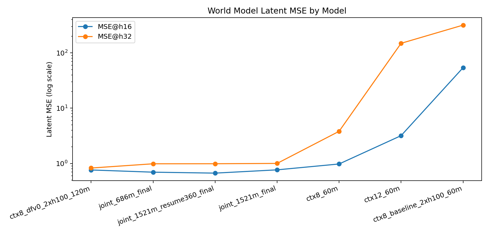
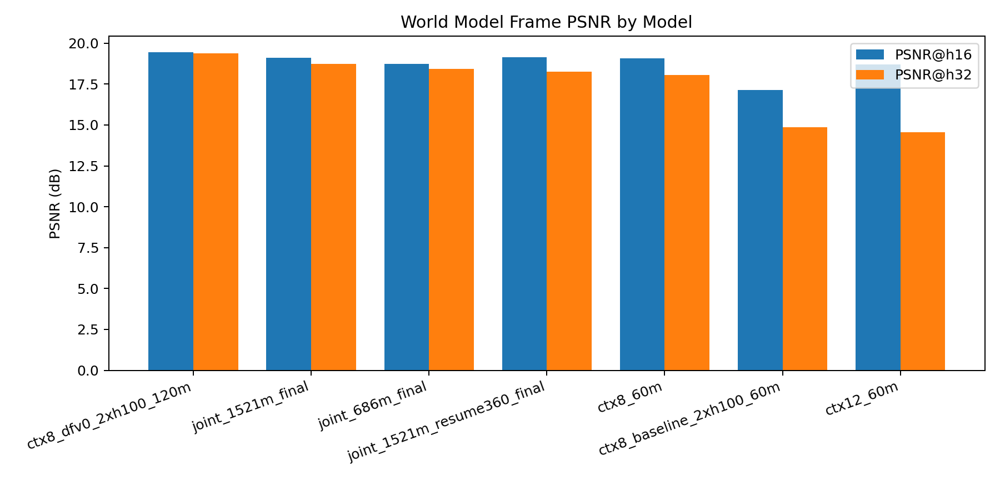

# MA'AT

  Action-conditioned world modeling for billiards and snooker using large synthetic datasets, VAE latent compression, diffusion transformers, and diffusion forcing.

  <a href="MA%27AT.pdf">Current Public Paper</a> ·
  <a href="paper/MAAT_renewed_paper.pdf">Renewed Paper PDF</a> ·
  <a href="paper/main.tex">Renewed Paper Source</a> ·
  <a href="https://youtu.be/WCvdq73E8tY">YouTube Presentation</a> ·
  <a href="milestones_preview/README.md">Milestones Bundle</a>

## Overview

MA'AT is a research project on playable world models for cue-sports environments. The core question is whether an action-conditioned diffusion model can preserve enough physical structure to behave like a lightweight interactive simulator rather than just a visually plausible video predictor.

The pipeline in this repo covers:

1. Large synthetic billiards data generation with aligned actions and simulator state.
2. VAE compression into compact latent representations.
3. Latent-space diffusion-transformer world-model training.
4. Baseline versus diffusion-forcing rollout evaluation.
5. Qualitative analysis of collisions, wall bounces, identity consistency, and long-horizon stability.

## Main Result

The strongest result in the current milestone package is the long-horizon gap between single-step baseline training and diffusion forcing:

| Model | MSE@16 | MSE@32 | PSNR@16 | PSNR@32 |
| --- | ---: | ---: | ---: | ---: |
| DiT baseline | 54.023 | 318.312 | 17.133 | 14.857 |
| DiT + Diffusion Forcing | 0.763 | 0.827 | 19.447 | 19.372 |

This is why the README emphasizes milestone media rather than only static documents: the qualitative clips make the physics-consistency story much clearer.

## Visual Milestones

This README now shows the milestone sequence directly. Folder names are used as the structure so the project can be followed step by step from the root page.

### `milestones_preview/data_collection/`

  

Raw data generation previews and dataset-scale artifacts.
Files shown in this stage: `raw_episode_s3_20s.mp4`, `generated_episode_20s.mp4`, `raw_preview_strip_ep0.png`.

### `milestones_preview/vae/`

  

VAE reconstruction quality and latent-space comparison.
Files shown in this stage: `vae_preview_60m_8s.mp4`, `vae_latent_compare_ep0_13s.mp4`, `vae_preview_grid_60m.png`.

### `milestones_preview/world_model/`

  

General world-model rollout previews.
Files shown in this stage: `clip_000.mp4`, `clip_001.mp4`, `good-collusion example.mp4`.

### `milestones_preview/world_model/baseline_vs_df/`

  

Direct baseline versus diffusion-forcing comparison.
File shown in this stage: `ctx8_baseline_vs_dfv0_8s.mp4`.

### `milestones_preview/world_model/checkpoint_progression/`

  

Progression from 686M through later checkpoints and resume training.
Files shown in this stage: `checkpoint_progression_686m_to_1521m_8s.mp4`, `joint_686m_final_8s.mp4`, `joint_1521m_final_8s.mp4`, `joint_1521m_resume360_8s.mp4`.

### `milestones_preview/world_model/ddim_steps_comparison/`

  

Inference tradeoff comparison across DDIM step counts.
Files shown in this stage: `ddim08_8s.mp4`, `ddim12_8s.mp4`, `ddim20_8s.mp4`, `ddim30_8s.mp4`, `ddim_steps_1x4_8s.mp4`, `ddim_steps_2x2_8s.mp4`.

### `milestones_preview/world_model/long_rollout/`

  

Long-horizon stability preview.
File shown in this stage: `long_rollout_h128_10s.mp4`.

### `milestones_preview/latest_resume555m_preview_20260303/`

  

Latest resume rollout clips.
Files shown in this stage: `clip_000.mp4`, `clip_001.mp4`, `clip_002.mp4`.

### `milestones_preview/final_project_media/distill_20260304/`

  

Teacher-student distillation preview and comparison.
Files shown in this stage: `preview_teacher_clip_000.mp4`, `preview_student_clip_000.mp4`, `rollout_compare_clip_000.mp4`.

### `milestones_preview/gifs for esasy/`

  
  

Small GIF previews prepared for the paper and slide deck.

## Metric Snapshots

  
  

- Full charts directory: [`milestones_preview/charts/`](milestones_preview/charts/README.md)
- Full world-model media bundle: [`milestones_preview/world_model/`](milestones_preview/world_model/README.md)

## Papers

- Current public paper: [`MA'AT.pdf`](MA%27AT.pdf)
- Renewed paper PDF: [`paper/MAAT_renewed_paper.pdf`](paper/MAAT_renewed_paper.pdf)
- Renewed paper source: [`paper/main.tex`](paper/main.tex)
- Renewed paper bibliography: [`paper/refs.bib`](paper/refs.bib)
- Lightweight PDF build script: [`paper/build_public_pdf.py`](paper/build_public_pdf.py)

The renewed paper source has been cleaned for public release and a shareable PDF has been generated for the repo. Once a full TeX toolchain is available, this can be rebuilt with richer typesetting.

## Presentation

- Full project presentation: <https://youtu.be/WCvdq73E8tY>

## Repo Layout

- `milestones_preview/`: full milestone-by-milestone media package.
- `assets/readme/`: clean preview assets used by the root README.
- `paper/`: renewed paper source bundle.
- `MA'AT.pdf`: earlier public paper already uploaded to the repo.
